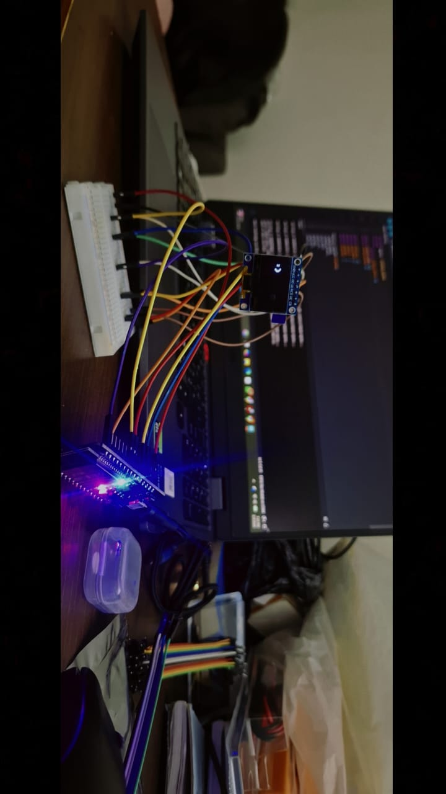
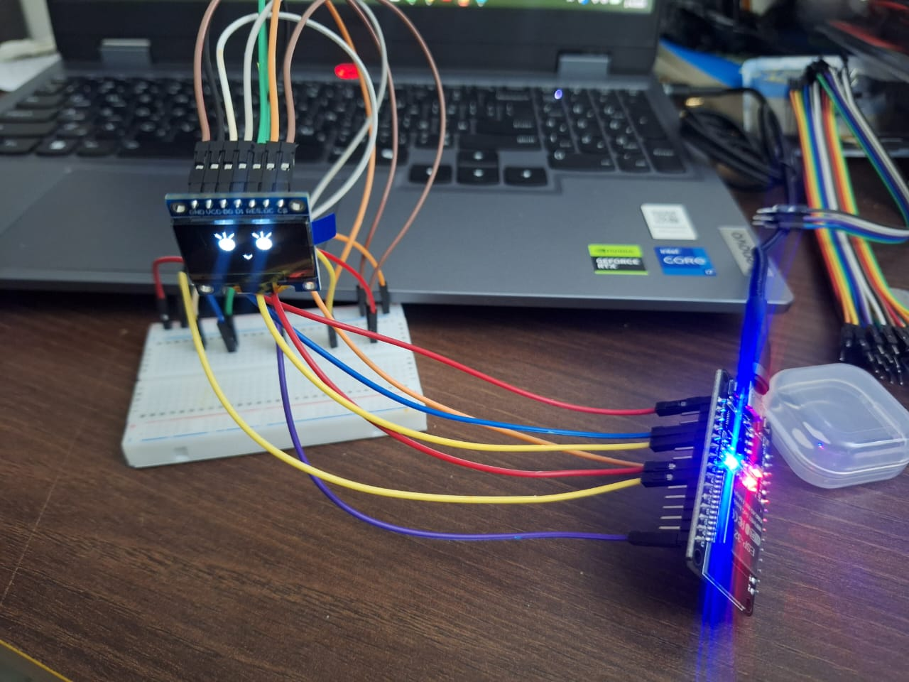

# Desktop Companion Robot (ESP32)

This is a small desktop robot I’m building using an ESP32.
The idea is to create something like a mini companion bot that can show expressions, move, and later respond to inputs.

---

## What I’ve done so far

* Set up ESP32 and Arduino IDE
* Connected and tested an SPI OLED display
* Got the display working and showing output
* Built simple expressions and then improved them into animated eyes
* Added blinking to make it feel more alive

---

## Progress

### First output

This was the first time I got the OLED working:

---

### Improved version

After that, I worked on making the eyes look better and added animation:

---

## Demo

Here’s a short video of the current result:

---

## What I’m working on now

* Connecting and controlling a servo motor
* Fixing power issues for stable movement
* Making the system more reliable

---

## Components used

* ESP32 DevKit
* 0.96" OLED display (SPI)
* SG90 servo motor
* Li-ion battery
* Boost converter

---

## What I’ve learned

* How to interface an OLED display with ESP32
* Drawing custom graphics instead of just text
* Basics of hardware wiring and debugging
* Power issues are a real challenge in hardware

---

## Next steps

* Make the head move using servos
* Add more expressions
* Add sensors (like IR or microphone)
* Eventually connect it with AI for responses

---

This is still a work in progress, I’ll keep updating it as I build more.
